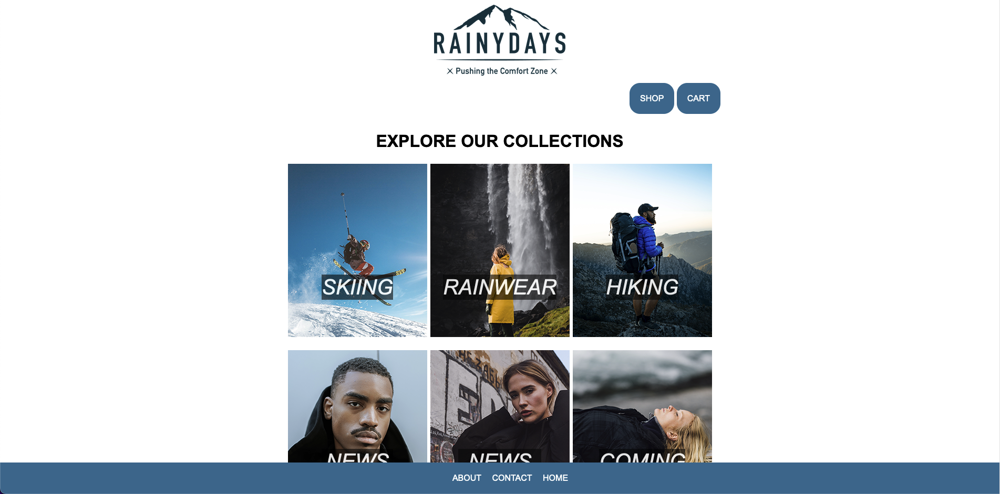

# Cross Course project / RainyDays


An webshop selling rainwear for both men and women, that are interested in outdoor activities such as hiking, exploring, skiing etc.

## Description
The brief of this course assignment was to deliver a functional desktop and mobile
prototype for a webshop. We had to keep in mind the target audience, a good
design and layout, and user-friendly navigation. The page need to be responsive and 
intriguing the target audience with color pallette, images and navigation.

- Responsive
- Minimalistic
- User friendly design
- Intuitive

[Crouss-course brief] (https://github.com/NoroffFEU/first-year-cross-course-assignment-brief-one)
[CMS brief] (https://content.noroff.dev/cms/ca.html)

## Built With

- [Figma](https://www.figma.com)
- HTML
- CSS
- Wordpress API
- Javascript
  
## Getting Started

### Installing

1. Clone the repo:

```bash
git clone  git@github.com:KineOnes/webshop.git
```

2. View on Netlify
   [Netlify](https://spectacular-sfogliatella-4aee07.netlify.app)

### Running

Clone the repo, open in Vscode. Right click on the index.html and open in Live Server.

## Contributing

Open a pull request and review the code.

## Contact

[My Behance Profile](https://www.behance.net/kineonesv)

[My Github Profile](https://github.com/KineOnes)
